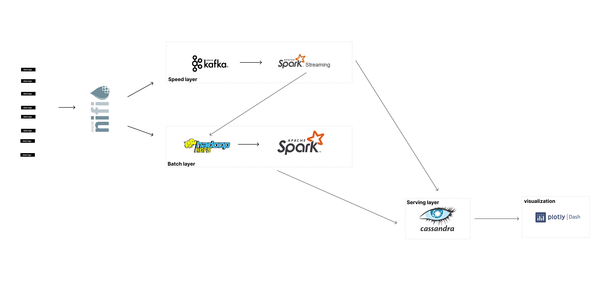
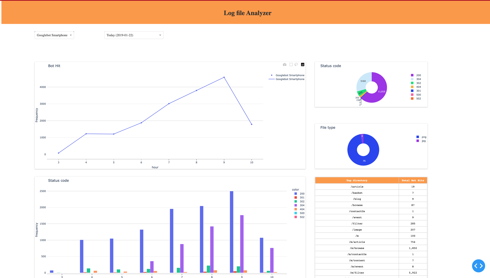
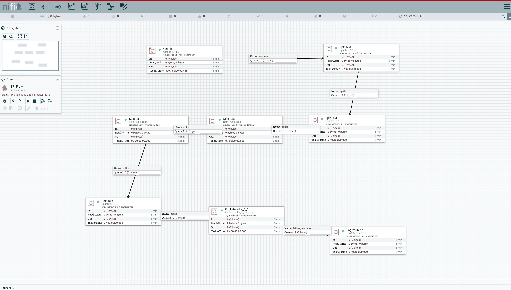

# Log analytics using lambda architecture

## Overview
Ever wonder what kind of bots visits your website? This project helps you identify the major search engine bots that visits your website and the activities they perform on your website. This project was built using lambda architecture, combining both real-time and batch data pipeline together. \
`ps`: You can also configure this project to use other kafka producer, rather than the producer used by apache nifi  

## Architecture

## Dashboard

## PROCESS
Stream log file from apache nifi  using kafka and zookeeper to  stream data to spark structured streaming, storing historical data in hdfs master dataset and computing batch view in cassandra, while prodcuing real-time view as well. The batch view could be done once a day, or twice as it uses  `precomputation algorithm, while the speed layer uses incremental`. YOU CAN USE TOOLS SUCH AS CRON OR  AIFRFLOW FOR SCHEDULING BATCH JOB AND DROPPING PREVIOUS DAY DATA IN REAL-TIME VIEW OF DATA PIPELINE

## Setup
**This project requires you to have docker up and running**
- To build docker image run `docker build -t log-viz .`
- Run `docker-compose -f docker-compose.yaml` to start the resources needed
- when docker-compose is up and running, run `bash ./setup.sh`

### Run real-time job 
`docker exec spark-master /spark/bin/spark-submit --master spark://localhost:7077 --packages org.apache.spark:spark-streaming-kafka-0-10_2.12:3.2.1,org.apache.spark:spark-sql-kafka-0-10_2.12:3.2.1,com.datastax.spark:spark-cassandra-connector_2.12:3.0.0 opt/spark_store/streaming/streaming-job.py`

### Setup nifi
- open nifi on http://localhost:9090/
- upload the template `nifi_log_setup.xml`
- It should look like this: 
- start all the resources
- copy the files into ./nifi/data_store/log
### Run batch job
`docker exec spark-master /spark/bin/spark-submit  --packages com.datastax.spark:spark-cassandra-connector_2.12:3.0.0 --master spark://localhost:7077 opt/spark_store/batch/batch-job.py`

### visualization
run `python3 visualization_dash/main.py`
### Web UI
- spark cluster - http://localhost:8080/
- Hadoop - http://localhost:9870/
- dashboard/visualization - http://localhost:3032/
- apache nifi - http://localhost:9090/

### Access image
- Cassandra - `docker exec -it cassandra cqlsh /bin/bash`
- Spark - `docker exec -it spark-master /bin/bash`
- Hadoop `docker exec -it namenode /bin/bash` run hadoop commands here, such as `hdfs dfs -ls /data`

### Other helpful commands
- To remove stored checkpoint in spark `docker exec spark-master rm -r /tmp`
- To delete the data in hdfs `docker exec namenode hdfs dfs -rm -r /data/`
